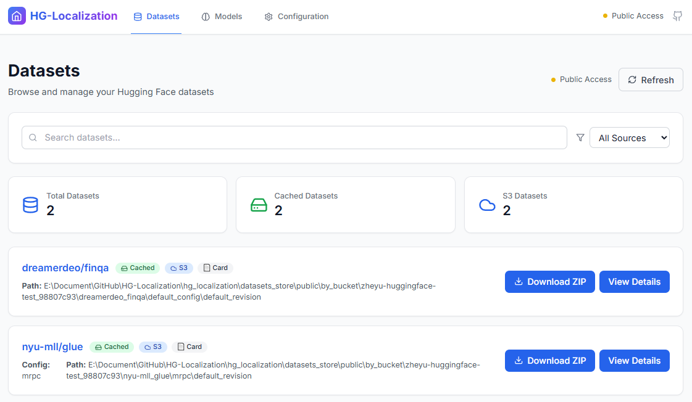
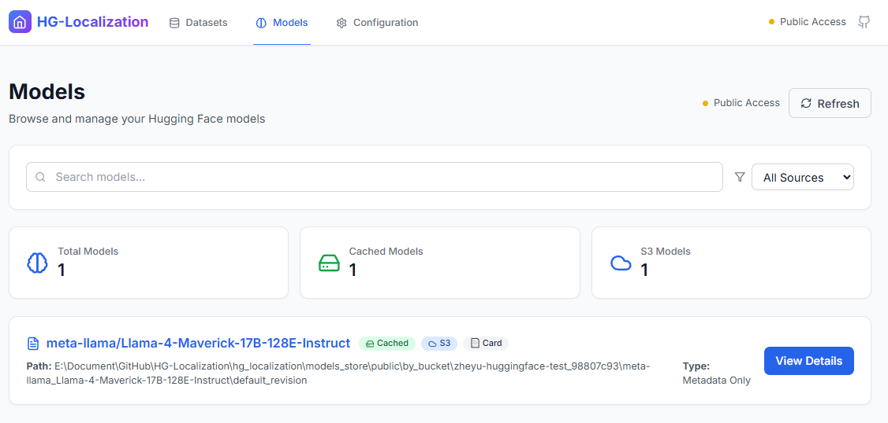
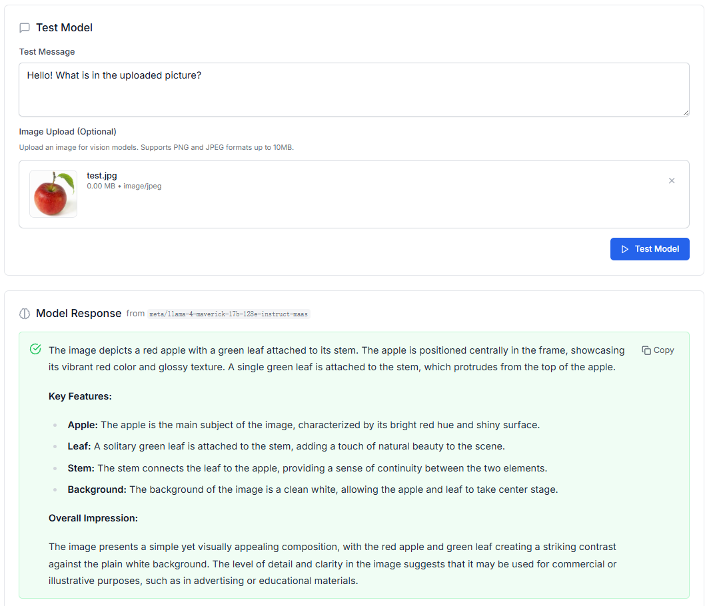
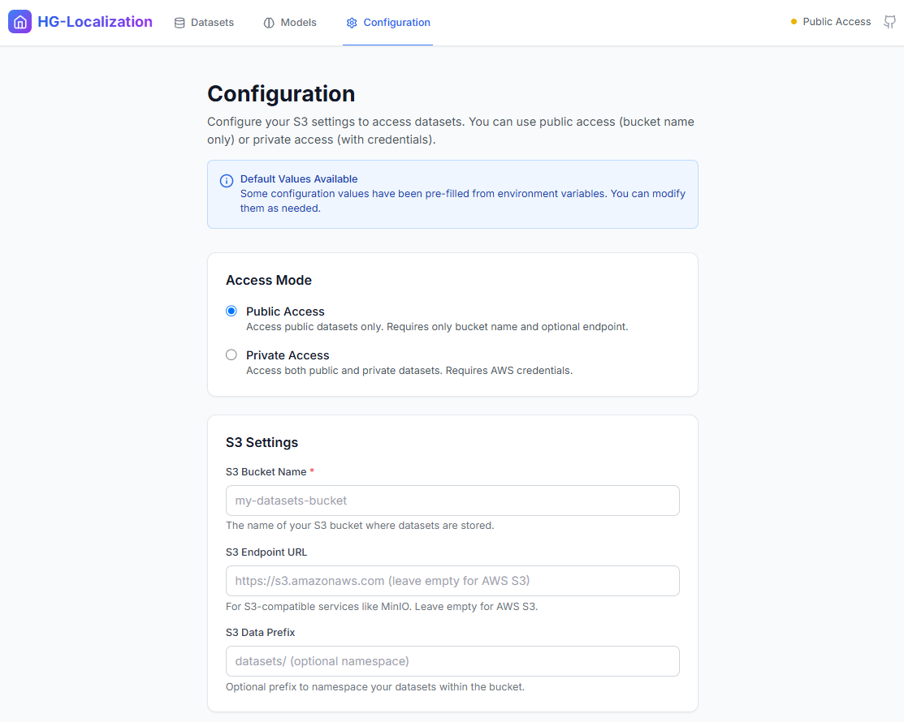

# hg_localization: Local Hugging Face Dataset and Model Management with UI

`hg_localization` is a comprehensive Python library and web application suite designed to help you download, store, and manage Hugging Face datasets and models, especially in environments with restricted internet access. It supports local caching, S3 integration, and provides both CLI tools and a modern web interface for seamless dataset and model management.

This solution enables teams to efficiently manage AI assets (datasets and models) in distributed environments where some users have internet access while others work in isolated networks with only S3 connectivity.

## Key Capabilities

### 📊 **Dataset Management**
*   **CLI for Dataset Operations**: Download from Hugging Face Hub, register private datasets, and manage local cache using the `hg-localize` command
*   **Local Dataset Cache**: Hierarchical storage with `dataset_id/config_name/revision/` structure
*   **S3 Integration**: Automatic sync between local cache and S3 buckets for team collaboration

### 🤖 **Model Management** 
*   **Model Metadata Caching**: Download and cache model cards, configuration files, and documentation
*   **Full Model Support**: Optional downloading of complete models including weights and tokenizers
*   **Model Discovery**: Browse and explore model information without downloading large files
*   **Offline Access**: Work with model metadata when disconnected from the internet

### 🧪 **Model Testing**
*   **Interactive Testing**: Test models directly through the web interface with custom prompts
*   **Multi-modal Support**: Test both text-only and vision models with image inputs
*   **API Integration**: Connect to OpenAI-compatible endpoints for model inference
*   **Availability Checking**: Verify model accessibility before testing

### 🌐 **Web Interface (UI Backend & Frontend)**
*   **Modern React Frontend**: Responsive, TypeScript-based interface with Tailwind CSS styling
*   **FastAPI Backend**: RESTful API with WebSocket support for real-time operations
*   **Dataset Discovery**: Browse, preview, and download datasets through an intuitive interface
*   **Model Testing Interface**: Interactive model testing with prompt input and response viewing
*   **Configuration Management**: Dynamic S3 and API endpoint configuration
*   **Real-time Progress**: Live updates for download and upload operations
*   **Code Generation**: Auto-generated Python snippets for programmatic dataset usage

### UI Screenshots

#### Dataset Management Interface

*Dataset browsing and management interface showing available datasets, their configurations, and download options.*

#### Model Management Interface

*Model browsing and management interface displaying available models, their metadata, and download options. Includes model cards, configuration details, and version information.*

#### Model Testing Interface

*Interactive model testing interface with prompt input, response display, and model configuration options.*

#### Configuration Settings

*Dynamic configuration panel for managing S3 credentials and API endpoints.*

## Features

*   **CLI for Dataset & Model Operations**: Easily download, register, list, and sync both datasets and models using the `hg-localize` command with precise specification of IDs, configurations, and revisions
*   **Local Asset Cache**: Both datasets and models are cached locally (default: `datasets_store/` and `models_store/`) using hierarchical structures
*   **S3 Integration**:
    *   Automatically uploads assets to configured S3 bucket using the same hierarchical path
    *   Fetches assets from S3 to local cache if not found locally
    *   Supports public sharing via ZIP archives and manifest files
*   **Web Interface**: Complete web application with FastAPI backend and React frontend for visual management
*   **Model Testing**: Interactive testing of models through OpenAI-compatible APIs
*   **Python API**: Programmatic access to download, load, and list both datasets and models
*   **Precise Asset Specification**: Differentiates between asset ID, configuration name, and Git revision
*   **Configurable S3 Settings**: Environment variable configuration for S3 bucket, endpoint, and credentials

## Common Use Cases

`hg-localization` is designed to streamline dataset management in two primary scenarios:

### 1. Private Team Sharing with a Common S3 Bucket

*   **Scenario**: A data science or ML engineering team operates within an environment that might have restricted direct internet access (e.g., to Hugging Face Hub) but has access to a shared S3 bucket. The team works with datasets from Hugging Face Hub as well as their own custom-created datasets.
*   **How it works**:
    *   One or more team members can use `hg-localize download` to fetch datasets from Hugging Face. For private datasets created by the team (assuming they are structured locally in a Hugging Face `datasets` compatible format), they can be manually placed into the local cache structure (`datasets_store/<dataset_id>/<config_name>/<revision>/`) and then `hg-localize` can be used to upload them to S3 (future commands might directly support registering local datasets for S3 upload).
    *   All team members configure their `hg-localization` environment with the *same* S3 bucket details and AWS credentials (e.g., via environment variables or a `.env` file).
    *   When a team member needs a dataset (public or private), `hg-localization` (either via `hg-localize download` or the Python API's `load_local_dataset` function) first checks the local cache. If not found, it seamlessly downloads it from the shared S3 bucket into their local cache.
*   **Benefits**:
    *   **Centralized Storage**: Datasets are stored once in the S3 bucket, serving as a single source of truth.
    *   **Reduced Redundancy**: Avoids multiple downloads of the same dataset from Hugging Face by team members.
    *   **Offline Access**: Enables team members in restricted environments to access datasets once they are in S3.
    *   **Version Consistency**: Ensures all team members can easily access the same version (dataset ID, config, revision) of a dataset.

### 2. Securely Sharing Datasets with External Teams or Publicly

*   **Scenario**: An individual or team (the "publisher") wants to make specific datasets (from Hugging Face Hub or their own custom datasets) available to other teams or the public without sharing their S3 bucket's write credentials.
*   **How it works**:
    *   The publisher, who has S3 write credentials, uses the `hg-localize download ... --make-public` command for datasets from Hugging Face. For custom/private datasets, they would first ensure the dataset is in their local cache (`datasets_store/<dataset_id>/<config_name>/<revision>/`) and then could use a similar mechanism or script leveraging `hg-localization`'s utilities to prepare it for public sharing (e.g., zipping it and updating `public_datasets.json` after uploading the zip with public-read ACLs).
    *   The `--make-public` process (or equivalent for custom datasets) involves creating a ZIP archive of the dataset. This ZIP is then uploaded to a specific prefix in the S3 bucket (e.g., `public_datasets_zip/`) with public-read ACLs.
    *   A `public_datasets.json` manifest file at the root of the S3 bucket is created/updated. This file, also public-read, lists all datasets made public and points to their respective ZIP archives in S3.
    *   Consumers (other teams or public users) only need to know the `HGLOC_S3_BUCKET_NAME` (and `HGLOC_S3_ENDPOINT_URL` if not AWS S3). They do **not** need AWS credentials.
    *   When a consumer uses `hg-localize download` or `load_local_dataset`, the tool will first check the local cache. If not found, it will attempt to fetch `public_datasets.json` from the publisher's S3 bucket. If the requested dataset is listed, its public ZIP is downloaded and unzipped into the consumer's local cache.
*   **Benefits**:
    *   **Secure Sharing**: Publishers share specific datasets without exposing their S3 write credentials or the entire bucket contents.
    *   **Ease of Access for Consumers**: Consumers can access these datasets with minimal configuration (just the bucket name).
    *   **Controlled Distribution**: Publishers decide which datasets are made public and manage the manifest.
    *   **Bandwidth Efficiency**: Consumers download pre-packaged ZIPs, potentially from CDN-enabled S3 endpoints.

## Web Interface (UI Backend & Frontend)

The `hg_localization` project includes a complete web application that provides a modern, intuitive interface for managing datasets and models. The web interface consists of a FastAPI backend and a React-based frontend, offering both visual management and interactive testing capabilities.

### Architecture Overview

#### Backend (FastAPI)
*   **RESTful API**: Built with FastAPI for high performance and automatic API documentation
*   **Real-time Updates**: WebSocket support for live progress tracking of downloads and uploads
*   **S3 Integration**: Dynamic configuration management for S3 endpoints and credentials
*   **Model Testing**: OpenAI-compatible API integration for interactive model testing
*   **Multi-modal Support**: Handles both text-only and vision model testing with image inputs

#### Frontend (React + TypeScript)
*   **Modern UI**: Built with React 18, TypeScript, and Tailwind CSS for a responsive, professional interface
*   **State Management**: React Query for efficient data fetching and caching
*   **Code Display**: Monaco Editor integration for syntax-highlighted code snippets
*   **File Upload**: Drag-and-drop interface for image uploads in model testing
*   **Real-time Progress**: Live updates for long-running operations

### Key Features

#### Dataset Management Interface
*   **Browse Datasets**: Visual catalog of local and S3 datasets with metadata display
*   **Dataset Preview**: Sample records viewing with schema information
*   **Download Management**: Interactive dataset downloading with progress tracking
*   **Configuration UI**: Dynamic S3 settings configuration without environment variables
*   **Code Generation**: Auto-generated Python snippets for programmatic dataset usage

#### Model Management Interface  
*   **Model Discovery**: Browse available models with metadata and documentation
*   **Model Cards**: Rich display of model documentation and usage examples
*   **Download Options**: Choose between metadata-only or full model downloads
*   **Model Testing**: Interactive interface for testing models with custom prompts

#### Model Testing Capabilities
*   **Text Prompts**: Test text-generation models with custom input
*   **Vision Models**: Upload images and test multimodal models
*   **API Configuration**: Connect to any OpenAI-compatible endpoint (Ollama, vLLM, etc.)
*   **Real-time Results**: Immediate response display with error handling
*   **Model Availability**: Check model accessibility before testing

### Quick Start Guide

#### Option 1: Automated Startup (Recommended)
```bash
# Clone the repository
git clone https://github.com/ECNU3D/hg-localization.git
cd hg-localization

# Install dependencies
cd hg_localization_ui/backend && pip install -r requirements.txt && cd ..
cd frontend && npm install && cd ..

# Start both services
python start_ui.py
```

Access the application:
- **Frontend**: http://localhost:3000
- **Backend API**: http://localhost:8000
- **API Docs**: http://localhost:8000/docs

#### Option 2: Docker Deployment
```bash
# Copy and configure environment
cp hg_localization_ui/env.example hg_localization_ui/.env
# Edit .env with your S3 and API configurations

# Start with Docker Compose
cd hg_localization_ui
docker-compose up -d
```

#### Option 3: Manual Setup
```bash
# Backend
cd hg_localization_ui/backend
pip install -r requirements.txt
uvicorn main:app --reload --host 0.0.0.0 --port 8000

# Frontend (in separate terminal)
cd hg_localization_ui/frontend
npm install
npm start
```

### Configuration Options

#### S3 Configuration
Configure S3 settings through the web interface or environment variables:
*   **S3 Bucket Name**: Your storage bucket
*   **S3 Endpoint URL**: For S3-compatible services (MinIO, etc.)
*   **AWS Credentials**: For private bucket access
*   **Data Prefix**: Namespace within bucket

#### Model Testing Configuration
*   **OpenAI Base URL**: Compatible API endpoint (e.g., http://localhost:11434/v1 for Ollama)
*   **API Key**: Authentication for the model service
*   **Timeout Settings**: Request timeout configuration

### Access Modes

1. **Public Mode**: Read-only access to public datasets
   - View and download public datasets
   - Browse model metadata
   - No credentials required

2. **Private Mode**: Full access with credentials
   - Upload and manage private datasets
   - Test models interactively
   - Make datasets public
   - Full read/write operations

### API Endpoints Overview

#### Configuration Management
*   `POST /api/config` - Set S3 and API configurations
*   `GET /api/config/status` - Check current configuration status

#### Dataset Operations
*   `GET /api/datasets/local` - List cached datasets
*   `GET /api/datasets/s3` - List S3 datasets
*   `POST /api/datasets/download` - Download dataset
*   `GET /api/datasets/{id}/preview` - Preview dataset samples

#### Model Operations
*   `GET /api/models/local` - List cached models
*   `POST /api/models/download` - Download model metadata
*   `GET /api/models/{id}/card` - Get model documentation

#### Model Testing
*   `POST /api/model-testing/test` - Test model with prompt
*   `POST /api/model-testing/check-availability` - Check model status

For complete API documentation, visit http://localhost:8000/docs when the backend is running.

## Installation

### Prerequisites
*   Python (3.8+ recommended)
*   pip

### Installation Steps
1.  Clone the repository (or obtain the source code):
    ```bash
    git clone https://github.com/ECNU3D/hg-localization.git # Replace with your actual repo URL
    cd hg-localization
    ```
2.  Create and activate a virtual environment (recommended):
    ```bash
    python -m venv venv
    source venv/bin/activate  # On Windows use `venv\Scripts\activate`
    ```
3.  Install dependencies:
    ```bash
    pip install -r requirements.txt
    ```
    The `requirements.txt` file should include `click`, `datasets`, `boto3`, and for development/testing `pytest`, `pytest-mock`, and `moto`.
4.  Install the library:
    ```bash
    pip install .
    ```
    Alternatively, for development (allows live changes without reinstalling):
    ```bash
    pip install -e .
    ```

## S3 Configuration (Environment Variables)

To use the S3 functionality, you need to set the following environment variables. These can also be placed in a `.env` file in the root of the project, which will be loaded automatically.

*   `HGLOC_S3_BUCKET_NAME`: (Required for most S3 operations) The name of your S3 bucket.
*   `HGLOC_AWS_ACCESS_KEY_ID`: (Required for S3 uploads/listing private datasets) Your AWS (or S3-compatible) access key ID.
*   `HGLOC_AWS_SECRET_ACCESS_KEY`: (Required for S3 uploads/listing private datasets) Your AWS (or S3-compatible) secret access key.
*   `HGLOC_S3_ENDPOINT_URL` (Optional): If using an S3-compatible service (e.g., MinIO, Ceph), provide its endpoint URL. For AWS S3, this can usually be omitted.
*   `HGLOC_AWS_DEFAULT_REGION` (Optional but recommended for AWS S3): The AWS region your bucket is in (e.g., `us-east-1`).
*   `HGLOC_S3_DATA_PREFIX` (Optional): A prefix to use for all data stored in the S3 bucket. This allows you to namespace your datasets within the bucket (e.g., `my_project_data/`). Defaults to an empty string (root of the bucket).
*   `HGLOC_DATASETS_STORE_PATH` (Optional): The local file system path where datasets will be cached. Defaults to a `datasets_store` subdirectory within the `hg_localization` package.

If `HGLOC_S3_BUCKET_NAME` is not set, S3 upload/download operations will be skipped (local cache only).
If only `HGLOC_S3_BUCKET_NAME` (and optionally `HGLOC_S3_ENDPOINT_URL`) are set without AWS credentials, the tool can still download datasets made public via the `--make-public` feature (see CLI `download` command).

## Dataset Storage Path Structure

Datasets are stored hierarchically, both in the local cache and on S3:

*   **Local Cache Root**: By default, `datasets_store/` located at the root of the project. This path is accessible via `hg_localization.DATASETS_STORE_PATH`.
*   **S3 Bucket Root**: `s3://<HGLOC_S3_BUCKET_NAME>/`
    *   If `HGLOC_S3_DATA_PREFIX` is set (e.g., to `my-data/`), the effective S3 root for datasets becomes `s3://<HGLOC_S3_BUCKET_NAME>/my-data/`.
    *   The `public_datasets.json` and the `public_datasets_zip/` directory will also be located under this prefix.

*   **Path Structure under root** (local cache) or effective S3 root:
    `<dataset_id_on_hub>/<config_name_or_default_config>/<revision_or_default_revision>/...`
    *   `dataset_id_on_hub`: The Hugging Face dataset ID (e.g., `glue`, `wikiann`, `username/custom_dataset`). Slashes (`/`) in the `dataset_id` are replaced with underscores (`_`) for path safety.
    *   `config_name_or_default_config`: The specific configuration name (e.g., `mrpc`, `en`). If no config name is provided, it defaults to `default_config`.
    *   `revision_or_default_revision`: The Git revision (branch, tag, commit hash). If no revision is provided, it defaults to `default_revision`.

## Command-Line Interface (CLI) Usage

The primary command is `hg-localize`.

### 1. `hg-localize download`

Downloads a dataset from Hugging Face, caches it locally. If S3 credentials are configured, it uploads the dataset to your private S3 bucket. Can also create and upload a public ZIP archive.

**Synopsis:**
```bash
hg-localize download <DATASET_ID> [options]
```

**Arguments:**
*   `DATASET_ID`: The Hugging Face dataset ID (e.g., `glue`, `squad`, `username/my_dataset`).

**Options:**
*   `--name, -n TEXT`: The specific dataset configuration name (e.g., "mrpc" for `glue`, "en" for `wikiann`).
*   `--revision, -r TEXT`: The git revision (branch, tag, commit hash) of the dataset.
*   `--trust-remote-code / --no-trust-remote-code`: Allow/disallow running code from the dataset's repository. Default is usually `--no-trust-remote-code`.
*   `--make-public / --no-make-public`: If S3 is configured with credentials, this will:
    1.  Download the dataset from Hugging Face.
    2.  Save it to the local cache.
    3.  Upload the original dataset structure to the standard S3 prefix (e.g., `s3://<bucket>/<dataset_id>/<config>/<revision>/`).
    4.  Create a ZIP archive of the dataset from the local cache (e.g., `dataset_id---config_name---revision.zip`).
    5.  Upload this ZIP archive to a public-read location in your S3 bucket (under the `public_datasets_zip/` prefix, which itself is under `HGLOC_S3_DATA_PREFIX` if set).
    6.  Update (or create) a `public_datasets.json` file at the root of your S3 bucket (or under `HGLOC_S3_DATA_PREFIX` if set). This JSON file lists all available public datasets and their S3 ZIP locations, and is itself public-read.
*   `--no-s3-upload / --s3-upload` (Default: `--s3-upload`): If `--no-s3-upload` is specified, the dataset will be downloaded and cached locally but will NOT be uploaded to S3, regardless of S3 configuration or the `--make-public` flag. This is useful for purely local caching without any S3 interaction for the download operation.
*   `--help`: Show this message and exit.

**Examples:**

*   **Download `mrpc` configuration of `glue` (default revision), allowing remote code:**
    ```bash
    # Assumes no S3 upload or only private S3 upload based on env vars
    hg-localize download glue --name mrpc --trust-remote-code
    ```

*   **Download `en` config of `wikiann` using Git tag `v1.2`:**
    ```bash
    hg-localize download wikiann --name en --revision v1.2
    ```

*   **Download a dataset and make it public (requires S3 credentials):**
    This downloads "glue/mrpc", caches it, uploads to standard S3 prefix, creates a public zip, uploads it, and updates `public_datasets.json`.
    ```bash
    # Ensure S3 env vars for upload are set:
    # export HGLOC_S3_BUCKET_NAME="your-s3-bucket-name"
    # export HGLOC_AWS_ACCESS_KEY_ID="your_access_key"
    # export HGLOC_AWS_SECRET_ACCESS_KEY="your_secret_key"
    # Optional for S3-compatible storage:
    # export HGLOC_S3_ENDPOINT_URL="https://your-s3-compatible-endpoint.com"

    hg-localize download glue --name mrpc --make-public --trust-remote-code
    ```

#### Downloading Publicly Shared Datasets (No S3 Credentials Needed)

If an administrator has used `--make-public`, users without S3 write credentials can download these datasets. They only need `HGLOC_S3_BUCKET_NAME` (and `HGLOC_S3_ENDPOINT_URL` if applicable) set.

*   **Environment for user without S3 write credentials:**
    ```bash
    export HGLOC_S3_BUCKET_NAME="your-s3-bucket-name"
    # Optional for S3-compatible storage:
    # export HGLOC_S3_ENDPOINT_URL="https://your-s3-compatible-endpoint.com"
    # HGLOC_AWS_ACCESS_KEY_ID and HGLOC_AWS_SECRET_ACCESS_KEY are NOT set.
    ```

*   **Command to download a dataset previously made public:**
    ```bash
    hg-localize download glue --name mrpc
    ```

*   **Behavior:**
    1.  Checks local cache for `glue/mrpc`.
    2.  If not found, attempts to fetch `public_datasets.json` from the S3 bucket (e.g., `https://<bucket>.s3.amazonaws.com/<HGLOC_S3_DATA_PREFIX_if_set/>public_datasets.json`).
    3.  If `public_datasets.json` lists `glue---mrpc---default_revision`, it downloads the corresponding public ZIP.
    4.  Unzips it into the local cache (e.g., `datasets_store/glue/mrpc/default_revision/`).
    5.  Loads the dataset.

### 2. `hg-localize list-local`

Lists datasets currently available in the local cache.

**Synopsis:**
```bash
hg-localize list-local
```
Output will show `Dataset ID`, `Config Name`, and `Revision`.

**Example:**
```bash
hg-localize list-local
```

### 3. `hg-localize list-s3`

Lists datasets available in the configured S3 bucket based on the standard directory structure (not just public zips).
Requires S3 read credentials (`HGLOC_AWS_ACCESS_KEY_ID`, `HGLOC_AWS_SECRET_ACCESS_KEY`).

**Synopsis:**
```bash
hg-localize list-s3
```
Output will show `Dataset ID`, `Config Name`, and `Revision`.

**Example:**
```bash
# Ensure S3 env vars for listing are set:
# export HGLOC_S3_BUCKET_NAME="your-s3-bucket-name"
# export HGLOC_AWS_ACCESS_KEY_ID="your_access_key"
# export HGLOC_AWS_SECRET_ACCESS_KEY="your_secret_key"

hg-localize list-s3
```

### 4. `hg-localize sync-local-to-s3`

Synchronizes a specific dataset found in the local cache (`datasets_store/`) to the configured S3 bucket. It performs the following for the specified dataset:

1.  **Locates Local Dataset**: Checks if the specified dataset (ID, config, revision) exists in the local cache.
2.  **Checks S3**: Verifies if the dataset (with the specific ID, config, and revision) already exists in the standard S3 prefix (private copy).
3.  **Uploads if Missing**: If the dataset is not found on S3, it uploads the entire dataset directory from the local cache to the corresponding S3 prefix.
4.  **Handles `--make-public` (Optional)**:
    *   If the `--make-public` flag is used, after ensuring the private copy is on S3 (either pre-existing or just uploaded), it will proceed to create and upload a public ZIP archive for that specific dataset.
    *   It checks if a public ZIP for this dataset version already exists. If not, it creates one from the local dataset files.
    *   The ZIP is uploaded to the `public_datasets_zip/` S3 prefix with a public-read ACL.
    *   The `public_datasets.json` manifest in S3 is updated to include or update the entry for this dataset, pointing to the public ZIP.

This command is useful if you have manually downloaded or organized a dataset into your local `datasets_store/` directory (following the `dataset_id/config_name/revision/` structure) and now want to push that specific dataset to S3, potentially making it public.

**Synopsis:**
```bash
hg-localize sync-local-to-s3 <DATASET_ID> [options]
```

**Arguments:**
*   `DATASET_ID`: The dataset ID (e.g., `glue`, `username/my_dataset`) of the local dataset to sync.

**Options:**
*   `--name, -n TEXT`: The specific dataset configuration name of the local dataset (e.g., "mrpc" for `glue`). Optional; defaults to `default_config` if not specified and the directory structure reflects that.
*   `--revision, -r TEXT`: The git revision (branch, tag, commit hash) of the local dataset. Optional; defaults to `default_revision` if not specified and the directory structure reflects that.
*   `--make-public / --no-make-public`: If this flag is active, it will also attempt to create/update the public ZIP archive and the S3 manifest file for the specified dataset. Requires S3 write credentials.
*   `--help`: Show this message and exit.

**Prerequisites for S3 operations:**
*   The specified dataset must exist in the local cache at the expected path (`datasets_store/<dataset_id>/<config_name>/<revision>/`).
*   S3 credentials (`HGLOC_AWS_ACCESS_KEY_ID`, `HGLOC_AWS_SECRET_ACCESS_KEY`) and `HGLOC_S3_BUCKET_NAME` must be configured for S3 uploads.

**Example:**

*   **Sync a specific local dataset `my_team/custom_data` (default config, default revision) to S3 (private copy only):**
    ```bash
    # Ensure S3 env vars for upload are set
    # Assume dataset exists at datasets_store/my_team_custom_data/default_config/default_revision/
    hg-localize sync-local-to-s3 my_team/custom_data
    ```

*   **Sync a specific local dataset `glue` with config `mrpc` to S3 and make it public:**
    ```bash
    # Ensure S3 env vars for upload are set
    # Assume dataset exists at datasets_store/glue/mrpc/default_revision/
    hg-localize sync-local-to-s3 glue --name mrpc --make-public
    ```

## Model CLI Commands

The CLI also provides comprehensive model management commands for downloading, listing, and viewing model metadata and documentation.

### 1. `hg-localize download-model`

Downloads model metadata (model card and config.json) or optionally the full model from Hugging Face, caches locally, and uploads to S3 if configured.

**Synopsis:**
```bash
hg-localize download-model <MODEL_ID> [options]
```

**Arguments:**
*   `MODEL_ID`: The Hugging Face model ID (e.g., `bert-base-uncased`, `microsoft/DialoGPT-small`, `username/my_model`).

**Options:**
*   `--revision, -r TEXT`: The git revision (branch, tag, commit hash) of the model.
*   `--make-public`: Upload the model to a public S3 location with public-read ACL.
*   `--no-s3-upload`: Disable uploading to S3, only cache locally.
*   `--full-model`: Download the complete model (weights, tokenizer, etc.) instead of just metadata. **Warning**: This can be very large!

**Examples:**

*   **Download model metadata only (lightweight):**
    ```bash
    hg-localize download-model bert-base-uncased
    ```

*   **Download full model with all weights:**
    ```bash
    hg-localize download-model bert-base-uncased --full-model
    ```

*   **Download specific revision and make public:**
    ```bash
    hg-localize download-model microsoft/DialoGPT-small --revision v1.0 --make-public
    ```

### 2. `hg-localize list-local-models`

Lists model metadata currently available in the local cache.

**Synopsis:**
```bash
hg-localize list-local-models
```

**Output includes:**
*   Model ID and revision
*   Whether model card and config are available
*   Whether it's metadata-only or full model

**Example:**
```bash
hg-localize list-local-models
```

### 3. `hg-localize list-s3-models`

Lists models available in the configured S3 bucket.

**Synopsis:**
```bash
hg-localize list-s3-models
```

### 4. `hg-localize show-model-card`

Displays the model card (README) content for a cached model.

**Synopsis:**
```bash
hg-localize show-model-card <MODEL_ID> [options]
```

**Options:**
*   `--revision, -r TEXT`: The git revision of the model.
*   `--try-huggingface`: Attempt to fetch from Hugging Face if not found locally.

**Example:**
```bash
hg-localize show-model-card bert-base-uncased --try-huggingface
```

### 5. `hg-localize show-model-config`

Displays the model configuration (config.json) for a cached model.

**Synopsis:**
```bash
hg-localize show-model-config <MODEL_ID> [options]
```

**Options:**
*   `--revision, -r TEXT`: The git revision of the model.
*   `--try-huggingface`: Attempt to fetch from Hugging Face if not found locally.

**Example:**
```bash
hg-localize show-model-config bert-base-uncased
```

## Python API Usage

### 1. Importing Functions

```python
# Dataset functions
from hg_localization import (
    download_dataset,
    load_local_dataset,
    list_local_datasets,
    list_s3_datasets,
    DATASETS_STORE_PATH
)

# Model functions
from hg_localization import (
    download_model_metadata,
    list_local_models,
    list_s3_models,
    get_model_card_content,
    get_cached_model_card_content,
    get_cached_model_config_content,
    MODELS_STORE_PATH
)
```

### 2. Dataset Operations

#### Downloading a Dataset (`download_dataset`)

Downloads from Hugging Face to local cache and, if S3 credentials are configured, uploads to S3.

```python
# Example: Download 'mrpc' config of 'glue' dataset
success, message_or_path = download_dataset(
    dataset_id="glue",
    config_name="mrpc",
    revision=None,  # Or specify a git revision string e.g., "main"
    trust_remote_code=True,
    make_public=False, # Set to True to attempt to create and upload public ZIP
    skip_s3_upload=False # Set to True to skip S3 upload entirely
)
if success:
    print(f"Dataset processed. Local path: {message_or_path}")
else:
    print(f"Failed to download dataset: {message_or_path}")
```

#### Listing Available Local Datasets (`list_local_datasets`)

```python
local_datasets = list_local_datasets()
for ds_info in local_datasets:
    print(f"Dataset - ID: {ds_info.get('dataset_id')}, Config: {ds_info.get('config_name')}, Revision: {ds_info.get('revision')}")
```

### 3. Model Operations

#### Downloading Model Metadata (`download_model_metadata`)

Downloads model metadata (card and config) or optionally the full model from Hugging Face.

```python
# Download model metadata only (lightweight)
success, path = download_model_metadata(
    model_id="bert-base-uncased",
    revision=None,  # Use default revision
    make_public=False,  # Don't make public
    skip_s3_upload=False,  # Upload to S3 if configured
    metadata_only=True  # Only download metadata (default)
)

# Download full model (including weights)
success, path = download_model_metadata(
    model_id="bert-base-uncased",
    metadata_only=False  # Download full model
)

if success:
    print(f"Model processed. Local path: {path}")
else:
    print(f"Error: {path}")
```

#### Listing Available Local Models (`list_local_models`)

```python
local_models = list_local_models()
for model_info in local_models:
    print(f"Model - ID: {model_info.get('model_id')}")
    print(f"  Revision: {model_info.get('revision', 'default')}")
    print(f"  Has Card: {model_info.get('has_card')}")
    print(f"  Has Config: {model_info.get('has_config')}")
    print(f"  Type: {'Full Model' if model_info.get('is_full_model', False) else 'Metadata Only'}")
```

#### Accessing Cached Model Content

```python
model_id = "bert-base-uncased"

# Get cached model card content
card_content = get_cached_model_card_content(model_id)
if card_content:
    print("Model Card:")
    print(card_content[:200] + "...")

# Get cached model config content
config_content = get_cached_model_config_content(model_id)
if config_content:
    print(f"Model Type: {config_content.get('model_type')}")
    print(f"Architecture: {config_content.get('architectures', [])}")
    print(f"Hidden Size: {config_content.get('hidden_size')}")

# Fetch model card directly from Hugging Face
card_content = get_model_card_content("bert-base-uncased")
```

### 4. Storage Paths

```python
# Access storage paths
print(f"Datasets stored in: {DATASETS_STORE_PATH}")
print(f"Models stored in: {MODELS_STORE_PATH}")
```

## Contributing

We welcome contributions to `hg_localization`! If you're interested in helping, please consider the following:

*   **Reporting Bugs**: If you find a bug, please open an issue on our GitHub repository. Include as much detail as possible, such as steps to reproduce, error messages, and your environment setup.
*   **Suggesting Enhancements**: Have an idea for a new feature or an improvement to an existing one? Feel free to open an issue to discuss it.
*   **Pull Requests**: If you'd like to contribute code, please fork the repository and submit a pull request. Ensure your code follows the existing style and includes tests where appropriate.

## License

This project is licensed under the MIT License - see the [LICENSE](LICENSE) file for details.

Copyright (c) 2025 Tony Wang